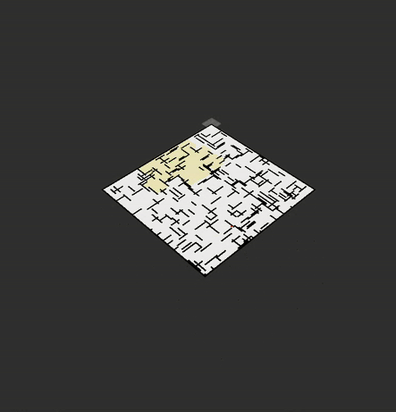

# ROS 2 Path Planning Workspace


## Table of Contents

- [Overview](#overview)
- [Packages](#packages)
  - [custom_interfaces](#custom_interfaces)
  - [path_planners](#path_planners)
- [Installation](#installation)
- [Building the Workspace](#building-the-workspace)
- [Usage](#usage)
  - [Launching Path Planners](#launching-path-planners)
- [Contributing](#contributing)
- [License](#license)
- [License Notice](#license-notice)

## Overview

This ROS 2 workspace provides a modular framework for experimenting with and comparing different path planning algorithms. The `custom_interfaces` package defines the message and service types used by the planners, while the `path_planners` package offers implementations and launch files for:

- **A\*** (`a_star.launch.py`)
- **Breadth-First Search (BFS)** (`bfs.launch.py`)
- **Depth-First Search (DFS)** (`dfs.launch.py`)
- **Dijkstra's Algorithm** (`dijakstra.launch.py`)

## Packages

### custom_interfaces

Defines custom ROS 2 messages and services for use by the path planning nodes.

Typical contents:
- `.msg` files for path requests and results
- `.srv` files for planner service calls

### path_planners

Implements several path planning algorithms as ROS 2 nodes.

Contains launch files for easy testing of each algorithm:
- `a_star.launch.py`
- `bfs.launch.py`
- `dfs.launch.py`
- `dijakstra.launch.py`

## Installation

Clone the repository:
```
git clone https://github.com/Subramanyanataraj/ROS2-Path-Planning.git
cd your_ros2_path_planning_ws
```


## Building the Workspace
```
source /opt/ros/humble/setup.bash
colcon build
source install/setup.bash
```


## Usage

### Launching Path Planners

Each algorithm has its own launch file in the `path_planners` package.

**Examples:**

- **A\* Planner:**
    ```
    ros2 launch path_planners a_star.launch.py
    ```
- **Breadth-First Search:**
    ```
    ros2 launch path_planners bfs.launch.py
    ```
- **Depth-First Search:**
    ```
    ros2 launch path_planners dfs.launch.py
    ```
- **Dijkstra's Algorithm:**
    ```
    ros2 launch path_planners dijakstra.launch.py
    ```

## Contributing

Contributions are welcome! Please open an issue or submit a pull request.

## License

This project is licensed under the MIT License.

---

## ⚠️ License Notice


MIT License

Copyright (c) 2025 Subramanya Nataraj

Permission is hereby granted, free of charge, to any person obtaining a copy
of this software and associated documentation files (the "Software"), to deal
in the Software without restriction, including without limitation the rights
to use, copy, modify, merge, publish, distribute, sublicense, and/or sell
copies of the Software, and to permit persons to whom the Software is
furnished to do so, subject to the following conditions:

The above copyright notice and this permission notice shall be included in all
copies or substantial portions of the Software.

THE SOFTWARE IS PROVIDED "AS IS", WITHOUT WARRANTY OF ANY KIND, EXPRESS OR
IMPLIED, INCLUDING BUT NOT LIMITED TO THE WARRANTIES OF MERCHANTABILITY,
FITNESS FOR A PARTICULAR PURPOSE AND NONINFRINGEMENT. IN NO EVENT SHALL THE
AUTHORS OR COPYRIGHT HOLDERS BE LIABLE FOR ANY CLAIM, DAMAGES OR OTHER
LIABILITY, WHETHER IN AN ACTION OF CONTRACT, TORT OR OTHERWISE, ARISING FROM,
OUT OF OR IN CONNECTION WITH THE SOFTWARE OR THE USE OR OTHER DEALINGS IN THE
SOFTWARE.
